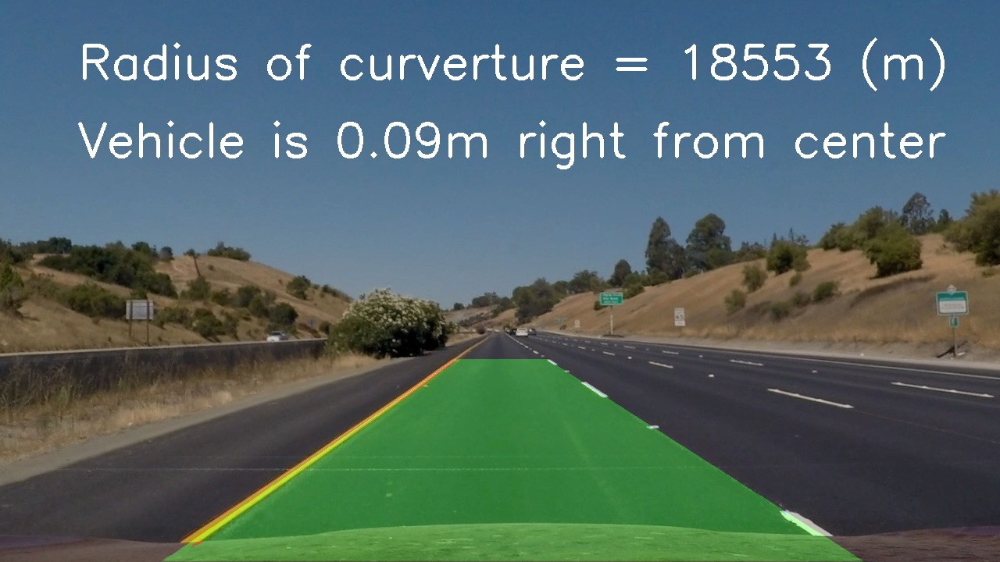

## Advanced Lane Finding

In this project, the goal is to write a software pipeline to identify the lane boundaries in a video, but the main output or product which should be created is a detailed writeup of the project.  For that the [writeup template](https://github.com/udacity/CarND-Advanced-Lane-Lines/blob/master/writeup_template.md)  is used as a starting point for creating MY own writeup.  

The Project
---

The goals / steps of this project are the following:

* Compute the camera calibration matrix and distortion coefficients given a set of chessboard images.
* Apply a distortion correction to raw images.
* Use color transforms, gradients, etc., to create a thresholded binary image.
* Apply a perspective transform to rectify binary image ("birds-eye view").
* Detect lane pixels and fit to find the lane boundary.
* Determine the curvature of the lane and vehicle position with respect to center.
* Warp the detected lane boundaries back onto the original image.
* Output visual display of the lane boundaries and numerical estimation of lane curvature and vehicle position.

The images for camera calibration are stored in the folder called `camera_cal`.  The images in `test_images` are for testing your pipeline on single frames.  

To help the reviewer examine your work, the examples of the output from each stage of the pipeline are saved in the folder called `output_images`, and included in the writeup for the project with a description of what each image shows.  

The video called `project_video.mp4` is the video with which the pipeline should work well on.  

The `challenge_video.mp4` video is an extra (and optional) challenge to test the pipeline under somewhat trickier conditions.  The `harder_challenge.mp4` video is another optional challenge and is brutal!

