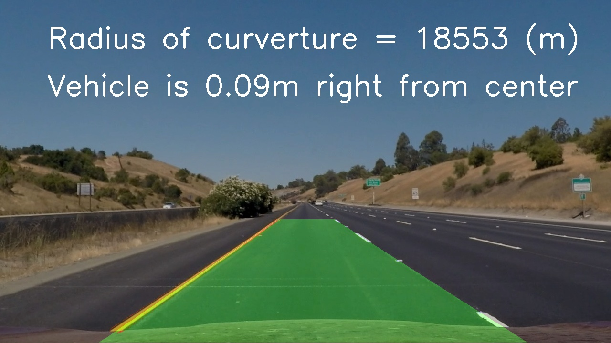

## Writeup Template

### You can use this file as a template for your writeup if you want to submit it as a markdown file, but feel free to use some other method and submit a pdf if you prefer.

---

**Advanced Lane Finding Project**

The goals / steps of this project are the following:

* Compute the camera calibration matrix and distortion coefficients given a set of chessboard images.
* Apply a distortion correction to raw images.
* Use color transforms, gradients, etc., to create a thresholded binary image.
* Apply a perspective transform to rectify binary image ("birds-eye view").
* Detect lane pixels and fit to find the lane boundary.
* Determine the curvature of the lane and vehicle position with respect to center.
* Warp the detected lane boundaries back onto the original image.
* Output visual display of the lane boundaries and numerical estimation of lane curvature and vehicle position.

[//]: # (Image References)

[image1]: ./camera_cal/calibration1_undist.jpg "Undistorted"
[image2]: ./test_images/test1.jpg "Road Transformed"
[image3]: ./examples/binary_combo_example.jpg "Binary Example"
[image4]: ./examples/warped_straight_lines.jpg "Warp Example"
[image5]: ./examples/color_fit_lines.jpg "Fit Visual"
[image6]: ./examples/example_output.jpg "Output"
[video1]: ./project_video.mp4 "Video"

## [Rubric](https://review.udacity.com/#!/rubrics/571/view) Points

### Here I will consider the rubric points individually and describe how I addressed each point in my implementation.  

---

### Writeup / README

#### 1. Provide a Writeup / README that includes all the rubric points and how you addressed each one.  You can submit your writeup as markdown or pdf.  [Here](https://github.com/udacity/CarND-Advanced-Lane-Lines/blob/master/writeup_template.md) is the template writeup  I used for this project.  

You're reading it!

### Camera Calibration

#### 1. Briefly state how you computed the camera matrix and distortion coefficients. Provide an example of a distortion corrected calibration image.

The code for this step is contained in code cell 2 to 19 of the IPython notebook located in "./Advanced Lane Line Detection Project.ipynb".

I start by preparing "object points", which will be the (x, y, z) coordinates of the chessboard corners in the world. Here I am assuming the chessboard is fixed on the (x, y) plane at z=0, such that the object points are the same for each calibration image.  Thus, `objp` is just a replicated array of coordinates, and `objpoints` will be appended with a copy of it every time I successfully detect all chessboard corners in a test image.  `imgpoints` will be appended with the (x, y) pixel position of each of the corners in the image plane with each successful chessboard detection. This procedure is performed in `get_object_image_points` function, which takes a list of grayscale images and the number of x- and y- chessboard corners as inpout and returns the `objpoints` object and `imgpoints` image points.

In `create_calibration_coef` I then used the output `objpoints` and `imgpoints` to compute the camera calibration and distortion coefficients using the `cv2.calibrateCamera()` function.  I applied this distortion correction to the test image using the `cv2.undistort()` function and obtained this result: 

<p>
    
    <br>
    <em>Original calibration image</em>
</p>

<p>
    
    <br>
    <em>Undistorted calibration image</em>
</p>

For future use I also save the camera calibration in a pickle file, which could be loaded in future. This avoids a new camera calibration each time the program is loaded and for each processing of an image. The calibratration file is located in "./camera_cal/calibration_data.p".
Consequently I also added the function `load_calibration_data` which loads exactly this calibration pickle file and return the content for further use.
### Pipeline (single images)

#### 1. Provide an example of a distortion-corrected image.

To demonstrate this step, I will describe how I apply the distortion correction to one of the test images like this one:

<p>
    
    <br>
    <em>Undistorted test image</em>
</p>

The distorton correction is performed in one step with binary thresholding and the perspective transform in the `get_binary_warped()` function in cell 27 of "./Advanced Lane Line Detection Project.ipynb". The function uses the original image and the camera calibration as input to perform the correction.

#### 2. Describe how (and identify where in your code) you used color transforms, gradients or other methods to create a thresholded binary image.  Provide an example of a binary image result.

I used a combination of color, gradient saturation and lightning thresholds to generate a binary image (thresholding steps at´re performed in `get_binary_warped()` function in cell 27 of "./Advanced Lane Line Detection Project.ipynb").  Here's an example of my output for this step.

<p>
    
    <br>
    <em>Result of binary thresholding preocess of test image</em>
</p>

#### 3. Describe how (and identify where in your code) you performed a perspective transform and provide an example of a transformed image.

The perspective transform is included in the same pipeline `get_binary_warped` and uses the `cv2.warpPerspective()` function. (output_images/examples/example.py) (or, for example, in the 3rd code cell of the IPython notebook).  The `get_binary_warped()` function takes as inputs an image (`img`), the transformation matrix `transforamtion_matrix` as well as source (`src`) and destination (`dst`) points.  I chose the hardcode the source and destination points in the following manner:

```python
src = np.float32([[(190,image.shape[0]),
                   (575, 460), 
                   (710, 460), 
                   (1150,image.shape[0])]]) 
x_ofs = 50
dst = np.float32([
                 [x_ofs,image.shape[0]], 
                 [x_ofs,0],
                 [image.shape[1] - x_ofs,0], 
                 [image.shape[1] - x_ofs,image.shape[0]]])
```

This resulted in the following source and destination points:

| Source        | Destination   | 
|:-------------:|:-------------:| 
| 190, 720      | 320, 720        | 
| 575, 460      | 320, 0      |
| 1150, 720     | 960, 0      |
| 1150, 720      | 960, 720        |

I verified that my perspective transform was working as expected by drawing the `src` and `dst` points onto a test image and its warped counterpart to verify that the lines appear parallel in the warped image.

<p>
    
    <br>
    <em>Distortion corrected image with source points</em>
</p>

<p>
    
    <br>
    <em>Warped image to "bird eyes" view with destination points</em>
</p>

#### 4. Describe how (and identify where in your code) you identified lane-line pixels and fit their positions with a polynomial?

To finally detect the lane lines pixes I created a `Line()` class to keep track of the detected lines. Also the functions to detect the lines are part of the `Line()` class.
To detect the line I created the `get_line()` function, which takes in a binary and warped image `binary_warped` and finally updates the line. To do so the following steps are performed:

1. Check if a line was detected in last iteration
    * If yes: Search for the new line based on the old line with `search_around_poly()` function
    * If not: Search the new line using a histogram to find lane line pixels with `find_lane_line()` function
    * Both functions return the positions of pixels idetified as lane line
2. Fit a second order polynominal function on the detected lane line pixels using the `fit_poly()` function. The mathematical equation for the polynom is . The function itself uses numpys `polyfit()` function to optimize the parameters A, B and C, to match best possible all line pixels `self.allx` and `self.ally`.
3. Finaly the result is filtered over several number of image(s) (frames) to get a smoother result. The number of iteration could be set using the variable `self.filter_n`. The higher the number is the slower the function reacts on changes of the lane line.

The following image shows the t´detected line pixels onthe original image for two lines - the left and right lane line:

<p>
    
    <br>
    <em>Warped image in "bird eyes" view with detected lane line pixels</em>
</p>

#### 5. Describe how (and identify where in your code) you calculated the radius of curvature of the lane and the position of the vehicle with respect to center.

For calculation of the radius the following formular is used:


The calculation itself I created the `measure_curverture()` function in the `Line()` class.

To calculate of the cars position with respect to the lane center, I define the position of each lane line with respect to the camera position with the `measure_line_base_pos()` function ine the `Line()` class. When I know the distance between the two lines from the camera position (which is the image center), I can calculate the difference of the camera to the ideal center by adding the two positions (Attention: the left line has always a negative sign)


Finaly the results are converted from pixel to meters using a fixed convertion ratio `self.ym_per_pix` (meters per pixel in y dimension) and `self.xm_per_pix`(meters per pixel in x dimension)
        
#### 6. Provide an example image of your result plotted back down onto the road such that the lane area is identified clearly.

I implemented this step in lines # through # in my code in `yet_another_file.py` in the function `map_lane()`.  Here is an example of my result on a test image:

<p>
    
    <br>
    <em>Processed image after the dection of lane lines, curveture estimation and vehicle position</em>
</p>

---

### Pipeline (video)

#### 1. Provide a link to your final video output.  Your pipeline should perform reasonably well on the entire project video (wobbly lines are ok but no catastrophic failures that would cause the car to drive off the road!).

Here's a [link to my video result](.output_videos/project_video.mp4)

---

### Discussion

#### 1. Briefly discuss any problems / issues you faced in your implementation of this project.  Where will your pipeline likely fail?  What could you do to make it more robust?

Generally it is quite difficult to find a generic solution which could handle all different kind of input files and also envirnmental conditions. So failed my pipeline for example when I tried the pipeline with images I got from the video, simply because the datatype of the images were `float` insted of `int`. Additionaly it is very difficulat to find thresholds which are good for all different kind of images. So I could imagine to change from simple constant values to threshold maps which allow to have different thresholds e.g. for generally bright images or dark images. Personlly I found color and saturation thresholds as the most powerfull but I added also gradient and lightning thresholds to be a bit more flexible on the images.

Especially with the [Hard Challenge Video](.output_videos/harder_challenge_video.mp4) my algorithm has some problems, coming from rapidly changing lightning conditions which could be improved like mentioned above. But also with the very sharp curves where I think the fixed source points in the perspective transform are limiting the algorithm. I could imagine that a flexible window based on the vehicle speed could help. For lower speeds I don't need a very large outlook, I anyway can only drive curves with a very high radius. For sharp curves I need a much lower vehicle speed and also not that large outlook in y direction.
